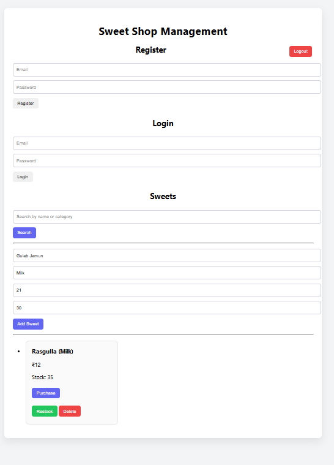
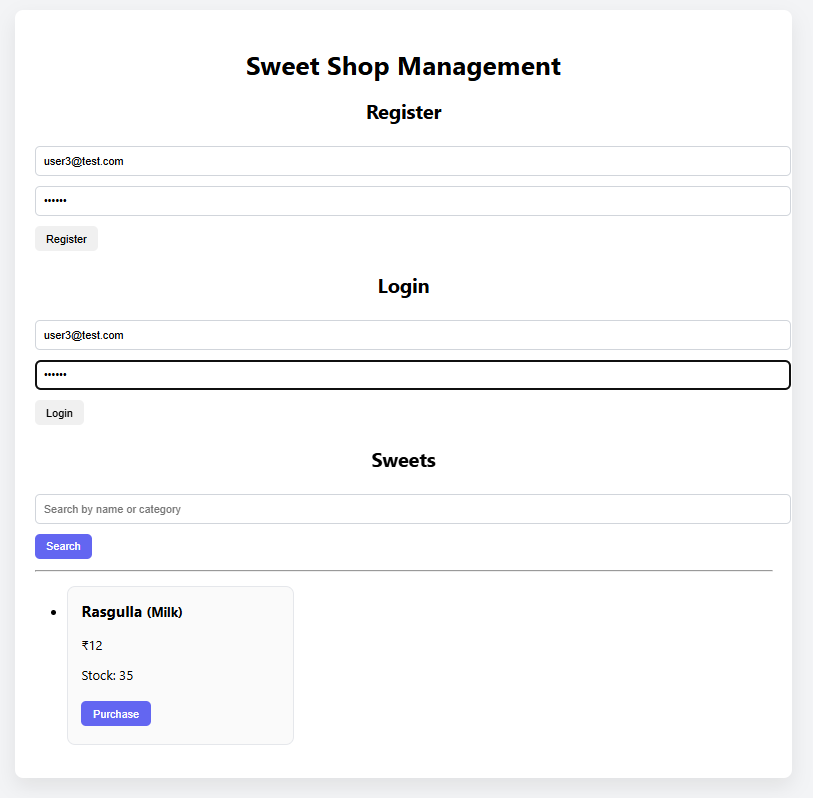
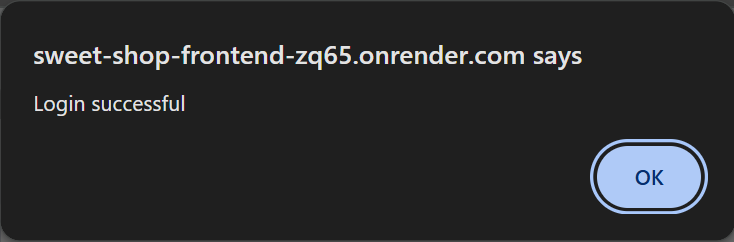

# 📌 Project Overview

The Sweet Shop Management System is a full-stack web application built to manage sweet inventory and sales operations using a clean, role-based architecture. The project emphasizes Test-Driven Development (TDD), secure authentication, and real-world deployment practices.

Users can register and log in using JWT-based authentication. The system enforces role-based authorization, where normal users can browse, search, and purchase sweets, while admin users can manage inventory by adding, restocking, or deleting sweets. All authorization rules are enforced server-side to ensure security.

Each sweet includes a name, category, price, and quantity. The application supports searching by name or category and prevents purchases when stock reaches zero. The frontend dynamically adapts based on user roles, hiding admin-only actions from non-admin users while the backend strictly enforces permissions.

The backend was developed using Test-Driven Development, with automated tests written using Jest and Supertest to validate authentication and core business logic. The application is fully deployed using Render for both frontend and backend services, with MongoDB Atlas as the database, reflecting a production-ready full-stack setup.

## ⚙️ Running the Project Locally

The project can be run locally by following the steps below. However, since the application is fully deployed, reviewers may also directly use the live links without any local setup.

### 🔹 Backend Setup

git clone https://github.com/zoya-234/sweet_shop_tdd_kata.git
cd sweet_shop_tdd_kata/backend
npm install

- Create a .env file in the backend directory with the following values:

PORT=5000
MONGO_URI=your_mongodb_atlas_connection_string
JWT_SECRET=your_jwt_secret

- Start the backend server:

npm start

- The backend will run at:

http://localhost:5000

### 🔹 Frontend Setup

cd ../frontend
npm install
npm run dev

- The frontend will be available at:

http://localhost:5173

## 🌐 Live Deployment (No Local Setup Required)

The application is fully deployed and can be accessed directly using the links below:

### Frontend:
https://sweet-shop-frontend-zq65.onrender.com

### Backend API:
https://sweet-shop-tdd-kata.onrender.com

## 🤖 My AI Usage

- AI Tool Used:

ChatGPT

- How It Was Used:

* To understand and apply Test-Driven Development (TDD) practices.
* To design and debug backend APIs, authentication, and role-based authorization.
* To troubleshoot deployment and frontend–backend integration issues.

- Reflection:
AI helped accelerate development and improve problem understanding, while all core logic, testing, and implementation decisions were performed and verified manually.

## 🧪 Test Report

Automated tests were written and executed for the backend using Jest and Supertest following Test-Driven Development principles.

### Test Coverage Includes:

* User registration
* Input validation
* Duplicate user handling
* Authentication behavior

### Test Execution:

- Tests were run locally using the following command:

npm test

## 📸 Screenshots

### Admin Dashboard
Admin users can add, restock, and delete sweets.

---

### User View
Normal users can browse and purchase sweets but cannot modify inventory.

---

### Authentication
User registration and login with JWT-based authentication.

